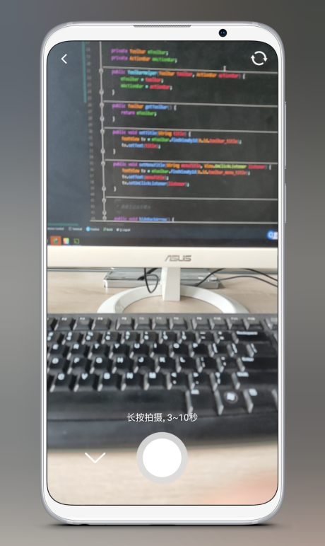

## Introduction
 -This project is an Android video editing project with functions such as video shooting, video cropping, video filters, and video compression.
 -I just integrate the following excellent open source frameworks to achieve a more complete video editor.

## Effect picture

 

 

 

 

 
 

## Thanks
 * [CJT2325](https://github.com/CJT2325/CameraView)
 * [ta893115871](https://github.com/ta893115871/VideoEdit)
 * [MasayukiSuda](https://github.com/MasayukiSuda/Mp4Composer-android)
 * [Tourenathan-G5organisation](https://github.com/Tourenathan-G5organisation/SiliCompressor)

## About
 -Dear, just star if you like~
 
## License
 
           Android-Video-Editor Copyright (C) 2018 LLhon hon0608@163.com
           This program comes with ABSOLUTELY NO WARRANTY; for details type `show w'.
           This is free software, and you are welcome to redistribute it
           under certain conditions; type `show c'for details.
 
       The hypothetical commands `show w'and `show c'should show the appropriate
       parts of the General Public License. Of course, your program's commands
       might be different; for a GUI interface, you would use an "about box".
 
         You should also get your employer (if you work as a programmer) or school,
       if any, to sign a "copyright disclaimer" for the program, if necessary.
       For more information on this, and how to apply and follow the GNU GPL, see
       <http://www.gnu.org/licenses/>.
 
         The GNU General Public License does not permit incorporating your program
       into proprietary programs. If your program is a subroutine library, you
       may consider it more useful to permit linking proprietary applications with
       the library. If this is what you want to do, use the GNU Lesser General
       Public License instead of this License. But first, please read
       <http://www.gnu.org/philosophy/why-not-lgpl.html>.
